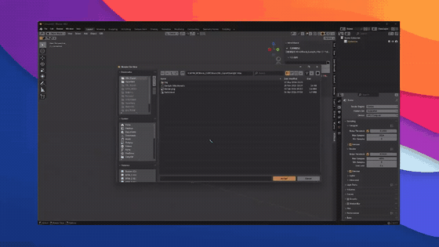

# Mine2Blend

> 把《我的世界》投影一键导入 Blender 的玩家工具


**Mine2Blend** 是面向 MC 玩家、动画师和教程创作者的 Blender 插件，用于把《我的世界》建筑投影直接导入 Blender，自动还原方块几何与材质，方便做渲染、动画和教程。

插件内置一套离线转换器，**无需手动安装 Node.js、也不依赖任何在线服务或服务器**——选中投影文件即可在本机完成转换并导入。

> ⚠️ 当前为 **0.4.6 内测版**，仅提供 Windows 10 / 11 x64 运行时，欢迎在 Issues 反馈问题。



> 🎬 演示：选中 `.litematic` / `.schem` 投影文件，一键导入 Blender 并自动还原方块几何与材质。

---

## ✨ 功能特性

- **多格式导入**：支持 `.litematic` 与 Sponge `.schem`（v2 / v3）两种主流投影格式
- **离线转换**：内置 Windows x64 转换器 runtime，导入全程在本机完成，无需联网、无需配置环境
- **材质还原**：自动处理贴图采样、透明、玻璃、水、植物裁切与 tint 染色，叶子 / 草类缺色时有默认兜底
- **多建筑共存**：不同建筑各自独立子集合、可自动并排，导入新建筑不会覆盖已导入的
- **投影管理面板**：已导入投影一行一个，可一键隐藏 / 删除 / 清空
- **诊断信息**：方块数、尺寸、材质数、面数、耗时、性能提示、材质审计一目了然
- **网站快捷入口**：一键打开 MCBlock 建筑库、网站在线编辑器和说明页

## 🧱 支持的格式

| 格式 | 状态 |
|------|------|
| `.litematic`（Litematica） | ✅ 已支持 |
| `.schem`（Sponge v2 / v3） | ✅ 已支持 |
| `.schematic`（旧版 MCEdit，数字方块 ID） | ⛔ 暂不支持 |
| `.nbt`（结构方块） | ⛔ 暂不支持 |

## 💻 系统要求

- **操作系统**：Windows 10 / 11 **x64**（暂未提供 macOS / Linux runtime）
- **Blender**：4.2 LTS 或更高（已在 5.1.2 实机验收）

## 📦 安装（玩家）

1. 在本仓库 [Releases](https://github.com/CAT-YC/Mine2Blend/releases) 页面下载最新的 `Mine2Blend.zip`（约 37 MB，内含转换器 runtime）。
2. 打开 Blender，进入 `Edit > Preferences > Get Extensions`（或 `Add-ons > Install from Disk`）。
3. 选择下载的 `Mine2Blend.zip` 安装并启用 **Mine2Blend**。
4. 在 `3D 视图 > 侧栏（N 键）> MCBlock` 找到插件面板。
5. 在「导入投影」中选择 `.litematic` / `.schem` 文件，点击导入。

> 💡 GitHub 仓库里的源码**不含**转换器运行时（`node.exe` / `node_modules`），所以请从 Releases 下载打包好的 `Mine2Blend.zip` 安装，而不是直接 clone 源码安装。

## 🛠️ 从源码构建（开发者）

本仓库为**纯源码仓**，刻意不收录第三方运行时二进制（`node.exe` 约 67 MB + `node_modules` 约 26 MB），以保持仓库轻量。构建可运行的插件包需要先补齐运行时：

1. clone 本仓库。
2. 进入转换器目录，按锁文件还原依赖，并放入一个 Windows x64 的 Node 运行时：
   ```bash
   cd resources/converter/win-x64
   npm ci          # 依据 package-lock.json 还原 node_modules
   # 再放入一个 Windows x64 的 node.exe 到本目录
   ```
3. 回到仓库根，运行打包脚本：
   ```bash
   python build_zip.py
   ```
   产物为 `dist/Mine2Blend.zip`，内部顶层会自动包成 `mcblock_mine2blend/` 包目录（Blender 安装所需），并通过结构自检。

> 📌 源码在仓库根是扁平铺开的，方便浏览；但 Blender add-on 安装包要求顶层是 `mcblock_mine2blend/` 包目录，因此请**用 `build_zip.py` 打包**，不要直接把仓库根压成 zip 安装。

### 仓库结构

```text
Mine2Blend/                          # 仓库根 = 插件源码（扁平）
├── README.md
├── .gitignore
├── build_zip.py                     # 打包脚本（自动包成 mcblock_mine2blend/ 安装包）
├── blender_manifest.toml            # 扩展清单（Blender 4.2+）
├── __init__.py
├── preferences.py
├── properties.py
├── core/                            # 转换桥接、材质、导入、诊断
├── operators/                       # 导入 / 材质 / 网站 / 诊断算子
├── panels/                          # N 面板 UI
└── resources/converter/win-x64/
    ├── src/batch-obj-export.mjs     # 转换器源码
    ├── package.json / package-lock.json
    ├── mcblock-litematic-converter.cmd
    └── assets/mcmeta/               # 方块定义 / 模型 / 贴图图集
    #   node.exe 与 node_modules 不在 git 中，构建时按上面步骤补齐
```

## 🌐 相关链接

- 插件说明页：<https://mcblock.top/blender>
- MCBlock 建筑库与网站在线编辑器：<https://mcblock.top>

## 📄 许可

本插件以 **GPL-3.0-or-later** 许可发布，版权 © 2026 MCBlock。

插件不包含《我的世界》游戏本体；`assets/mcmeta/` 下的方块定义与贴图数据仅用于在本机离线还原投影的几何与材质。Minecraft 是 Mojang Studios 的商标，本项目与 Mojang、Microsoft 无隶属关系。
